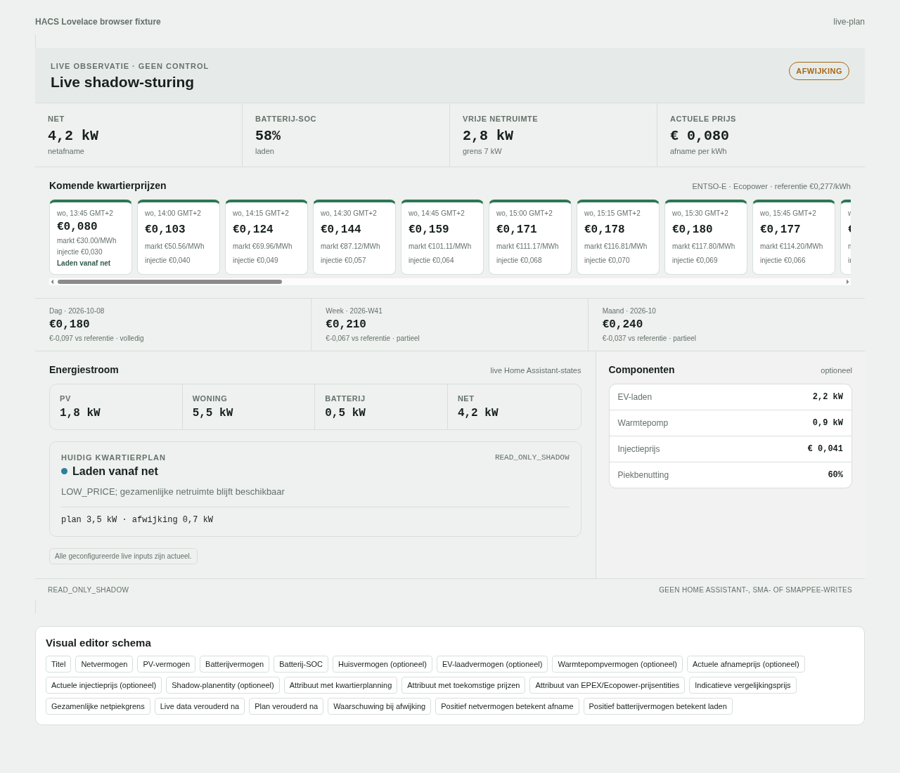

# Dynamic Energy Shadow Dashboard

Read-only Lovelace monitor for live Home Assistant energy values and a proposed
Day-Ahead battery shadow plan. The card never calls Home Assistant actions,
changes helper state or writes to SMA, Smappee, a battery or an EV charger.



## Features

- live grid, PV, battery and SOC values;
- optional house, EV, heat-pump and price entities;
- configurable shared grid-import limit and remaining headroom;
- current shadow-plan action, reason and planned-versus-actual deviation;
- upcoming quarter-hour market and tariff prices, compared with
  the indicative `€0.277/kWh` reference and aligned with planned actions;
- visible missing, unavailable and stale-data states;
- visual editor for entity mapping and thresholds;
- responsive light/dark Home Assistant styling;
- no runtime dependencies.

## Install with HACS

A committed GitHub revision or release is required before HACS can install the
artifact. No publication is performed automatically by this repository.

1. Open HACS in Home Assistant.
2. Open the three-dot menu and choose `Custom repositories`.
3. Select `Add custom repository`.
4. Enter the GitHub repository URL.
5. Select repository type `Dashboard`.
6. Install `Dynamic Energy Shadow Dashboard`.
7. Refresh the browser when HACS requests it.

## Configure through the GUI

1. Open or create a Lovelace dashboard.
2. Choose `Edit dashboard` and then `Add card`.
3. Select `Dynamic Energy Shadow Dashboard` from the card picker.
4. Use the visual editor to select the live entities and thresholds.

Recommended live mappings:

- grid power: signed grid power sensor;
- PV power: current PV generation;
- battery power: signed charge/discharge power;
- battery SOC: current percentage;
- optional house, EV and heat-pump power;
- optional current import and export price;
- optional plan entity containing the generated shadow schedule.

### Optional Home Assistant price integrations

The two supported frontend price inputs are:

1. a fresh shadow entity with validated `prices`, optional `price_aggregates`
   and source/tariff metadata attributes;
2. fresh `EPEX Spot Data` / `Ecopower Dynamic Prices` entities.

The card can also build the future timeline directly from Home Assistant price
entities whose `data` attribute contains `start_time`, `end_time` and
`price_per_kwh` rows. This contract is provided by the HACS integrations
`EPEX Spot Data` and `Ecopower Dynamic Prices`.

Recommended setup when those integrations are already available:

1. Install and configure `EPEX Spot Data` for Belgium through HACS.
2. Install `Ecopower Dynamic Prices` through HACS.
3. In the Ecopower integration, select the EPEX Spot sensor as `price_source`.
4. Select the Ecopower consumption sensor as `Actuele afnameprijs` in the card.
5. Select the Ecopower injection sensor as `Actuele injectieprijs`.
6. Keep `Attribuut van EPEX/Ecopower-prijsentities` set to `data`.
7. Keep the indicative comparison price at `0.277 EUR/kWh`, unless the owner
   deliberately changes that benchmark.

This is optional. The card selects one coherent source. It uses the fresh valid
source with the better upcoming interval coverage, so one partial shadow row does
not suppress a complete integration timeline. The price integrations remain
read-only inputs and do not create battery, inverter or charger controls.

The GUI supports sign conventions because integrations differ: grid import can
be positive or negative, and battery charging can be positive or negative.

## Plan entity contract

The optional observer entity should expose attributes named `schedule` and
`prices` by default. Price visibility does not depend on a valid battery plan:
`prices` remains populated when the plan state is `NO_ACTION`.

The `schedule` attribute is a list of quarter-hour objects:

```yaml
schedule:
  - start_utc: "2026-10-02T10:15:00+00:00"
    duration_hours: 0.25
    action: CHARGE_FROM_GRID
    reason: LOW_PRICE; shared-grid headroom remains
    planned_grid_import_kw: 3.5
    planned_grid_export_kw: 0
    charge_kwh: 0.25
    discharge_kwh: 0
```

The attribute name can be changed in the visual editor. Missing or stale plan
data remains visible and does not trigger a guessed action.

The `prices` attribute contains privacy-safe public market and tariff values:

```yaml
prices:
  - start_utc: "2026-10-02T10:15:00+00:00"
    duration_hours: 0.25
    market_eur_per_mwh: 80.0
    import_eur_per_kwh: 0.105
    export_eur_per_kwh: 0.064
price_source: Example validated shadow feed
price_tariff_version: ECOPOWER_DBS_2026-08-01
```

The observer feed also supplies compact `price_aggregates` for the latest day,
ISO week and month. Partial periods remain explicitly labelled in the card.
The visual-editor value `price_reference_eur_per_kwh` is authoritative; the card
recomputes displayed aggregate differences from that configured reference.

This public repository contains the frontend card only. It does not retrieve
ENTSO-E data, run a pricing backend or provide a REST-sensor deployment path.

## Manual YAML fallback

The visual editor is the default. YAML remains available for troubleshooting:

```yaml
type: custom:dynamic-energy-shadow-card
title: Shadow-sturing
grid_power_entity: sensor.grid_power
pv_power_entity: sensor.pv_power
battery_power_entity: sensor.battery_power
battery_soc_entity: sensor.battery_soc
plan_entity: sensor.shadow_plan_placeholder
plan_attribute: schedule
price_attribute: prices
integration_price_attribute: data
price_reference_eur_per_kwh: 0.277
peak_limit_kw: 7
stale_after_minutes: 10
grid_import_positive: true
battery_charge_positive: true
```

## Development validation

```bash
python3 -m unittest tests.test_hacs_lovelace_package -v
npm run test:hacs
npm run check:hacs
```

The HACS artifact is `dist/dynamic-energy-dashboard.js`.
